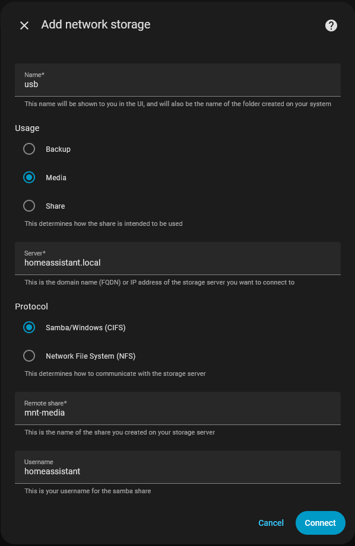

# Home Assistant Add-on: Samba share

## Installation

Follow these steps to get the add-on installed on your system:

1. Navigate in your Home Assistant frontend to **Settings** -> **Add-ons** -> **Add-on store**.
2. Find the "Samba share" add-on and click it.
3. Click on the "INSTALL" button.

## How to use

1. In the configuration section, set a username and password.
   You can specify any username and password; these are not related in any way to the login credentials you use to log in to Home Assistant or to log in to the computer with which you will use Samba share.
2. Review the enabled shares. Disable any you do not plan to use. Shares can be re-enabled later if needed.
3. Add new mounts as network storage in Home Assistant storage settings.

[](https://my.home-assistant.io/redirect/storage/)



## Connection

If you are on Windows you use `\\<IP_ADDRESS>\`, if you are on MacOS you use `smb://<IP_ADDRESS>` to connect to the shares.

This addon exposes the following directories over smb (samba):

Directory | Description
-- | --
`addons` | This is for your local add-ons.
`addon_configs` | This is for the configuration files of your add-ons.
`backup` | This is for your backups.
`config` | This is for your Home Assistant configuration.
`media` | This is for local media files.
`share` | This is for your data that is shared between add-ons and Home Assistant.
`ssl` | This is for your SSL certificates.

The fork makes the following additional directories available that USB drives can be mounted into:

Directory | Description
-- | --
`mnt-backup` | `/mnt/backup`
`mnt-media` | `/mnt/media`
`mnt-share` | `/mnt/share`

Mounts can also be put in subdirectories of these three directories, however Home Assistant requires a different share name for different mounts.
With these three, each type of network mount can be made with USB storage.

## Configuration

Add-on configuration:

```yaml
workgroup: WORKGROUP
local_master: true
username: homeassistant
password: YOUR_PASSWORD
enabled_shares:
  - addons
  - addon_configs
  - backup
  - config
  - media
  - mnt-backup
  - mnt-media
  - mnt-share
  - share
  - ssl
allow_hosts:
  - 10.0.0.0/8
  - 172.16.0.0/12
  - 192.168.0.0/16
  - 169.254.0.0/16
  - fe80::/10
  - fc00::/7
veto_files:
  - "._*"
  - ".DS_Store"
  - Thumbs.db
compatibility_mode: false
fstab:
  - /dev/sdb1 /mnt/media/ ext4  defaults  0 0
```

### Option: `workgroup` (required)

Change WORKGROUP to reflect your network needs.

### Option: `local_master` (required)

Enable to try and become a local master browser on a subnet.

### Option: `username` (required)

The username you would like to use to authenticate with the Samba server.

### Option: `password` (required)

The password that goes with the username configured for authentication.

### Option: `enabled_shares` (required)

List of Samba shares that will be accessible. Any shares removed or commented out of the list will not be accessible.

### Option: `allow_hosts` (required)

List of hosts/networks allowed to access the shared folders.

### Option: `veto_files` (optional)

List of files that are neither visible nor accessible. Useful to stop clients
from littering the share with temporary hidden files
(e.g., macOS `.DS_Store` or Windows `Thumbs.db` files)

### Option: `compatibility_mode`

Setting this option to `true` will enable old legacy Samba protocols
on the Samba add-on. This might solve issues with some clients that cannot
handle the newer protocols, however, it lowers security. Only use this
when you absolutely need it and understand the possible consequences.

Defaults to `false`.

### Option: `apple_compatibility_mode`

Enable Samba configurations to improve interoperability with Apple devices.
This can cause issues with file systems that do not support xattr such as exFAT.

Defaults to `true`.

### Option: `fstab`

List of mounts formatted like an /etc/fstab file.
